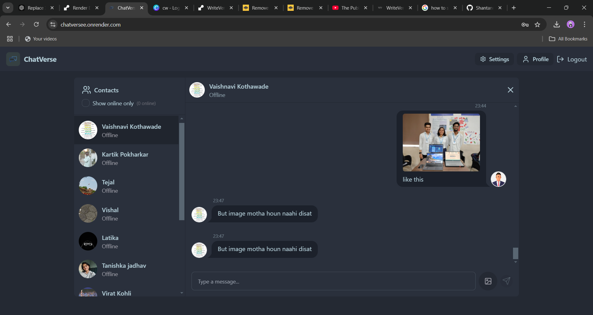
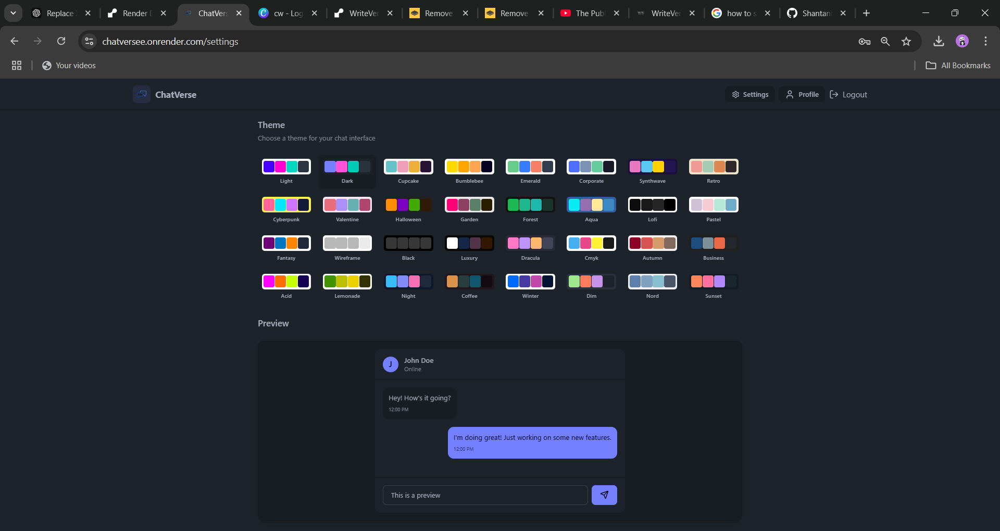

# 🌟 ChatVerse - Real-Time Chat Application 🚀  

Welcome to **ChatVerse**, a feature-rich, real-time chat application built to showcase the power of modern web technologies. Whether you're looking for seamless communication, dynamic personalization, or real-time interactions, ChatVerse has it all!  

---

## ⚡ Features  

- **Real-Time Messaging**: Instant communication powered by **Socket.io**.  
- **Online/Offline Status**: See who's available in real-time.  
- **32 Themes**: Personalize your experience with a wide array of themes using **DaisyUI**.  
- **Profile Picture Updates**: Change your profile picture in real-time with secure media handling via **Cloudinary**.  
- **Secure Connections**: End-to-end security for safe and reliable messaging.  

---

## 🛠️ Tech Stack  

### **1. MERN Stack**  
- **MongoDB**: For a flexible and scalable NoSQL database.  
- **Express.js**: Lightweight and fast server framework for handling routes and middleware.  
- **React.js**: A powerful front-end library for building dynamic and responsive user interfaces.  
- **Node.js**: Server-side JavaScript runtime for handling concurrent requests efficiently.  

### **2. Libraries and Tools**  
- **Socket.io**: For enabling real-time, bidirectional communication between clients and servers.  
- **Zustand**: A minimal, scalable state management library to keep the app's state simple and performant.  
- **Cloudinary**: For seamless and secure media storage and retrieval, ensuring smooth user profile management.  
- **DaisyUI**: A Tailwind CSS-based component library that makes UI design fast and beautiful.  
- **Render**: For effortless deployment and reliable hosting of the application.  

---

## 📚 Why These Technologies?  

- **Socket.io**: To power real-time interactions, ensuring smooth, lag-free messaging.  
- **Zustand**: Simplifies state management while keeping the app lightweight and efficient.  
- **Cloudinary**: Simplifies media handling with powerful APIs for image uploads and transformations.  
- **DaisyUI**: Offers ready-to-use UI components that saved time and enhanced the app's design.  
- **Render**: Provided an efficient and developer-friendly platform for hosting and deployment.  

---

## 🌐 Live Demo and Source Code  

- **Live Application**: [ChatVerse Live](https://chatversee.onrender.com/)  
- **GitHub Repository**: [ChatVerse Code](https://github.com/Shantanu-Kulkarni1229/Chat---App-FullStack.git)  

---

## 🚀 How to Run ChatVerse Locally  

1. **Clone the Repository**:  
   ```bash
   git clone <repository-url>
   cd chatverse
   ```

2. **Install Dependencies**:  
   ```bash
   npm install
   cd client && npm install
   ```

3. **Set Up Environment Variables**:  
   - Create a `.env` file in the root directory with the following:  
     ```plaintext
     MONGO_URI=<your-mongodb-uri>
     CLOUDINARY_CLOUD_NAME=<your-cloudinary-cloud-name>
     CLOUDINARY_API_KEY=<your-cloudinary-api-key>
     CLOUDINARY_API_SECRET=<your-cloudinary-api-secret>
     SOCKET_IO_SERVER=<your-socket-server-url>
     ```

4. **Start the Application**:  
   - Run the server:  
     ```bash
     npm start
     ```  
   - Start the client:  
     ```bash
     cd client && npm start
     ```  

5. **Access the Application**:  
   Open your browser and navigate to `http://localhost:3000`.  

---

## 📸 Screenshots  

  
*Real-time messaging with an intuitive UI.*  

  
*Theme selection for a personalized experience.*  

---

## 💡 What I Learned  

- Mastered **real-time communication** with WebSockets and Socket.io.  
- Streamlined state management with **Zustand**, making the app highly efficient.  
- Simplified media uploads and transformations with **Cloudinary**.  
- Designed scalable and aesthetic UI using **DaisyUI** and **Tailwind CSS**.  
- Deployed the app with **Render**, ensuring a smooth production environment.  

---

## 🤝 Contributing  

Want to contribute to ChatVerse? Here's how:  
1. Fork the repository.  
2. Create a feature branch:  
   ```bash
   git checkout -b feature/your-feature-name
   ```  
3. Commit your changes:  
   ```bash
   git commit -m "Add your message here"
   ```  
4. Push to the branch:  
   ```bash
   git push origin feature/your-feature-name
   ```  
5. Submit a pull request.  

---

## 🙌 Acknowledgments  

Thanks to all the amazing open-source projects that made ChatVerse possible.  

---

## 📧 Contact  

Feel free to reach out for questions or collaborations:  
**Email**: [shantanukulkarni1229@gmail.com]  
**LinkedIn**: [www.linkedin.com/in/shantanu-kulkarni1229]  

---

**Made with ❤️ and MERN**  
